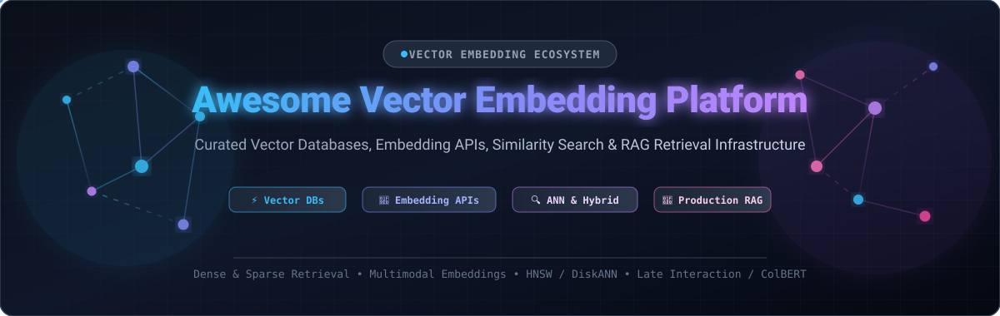
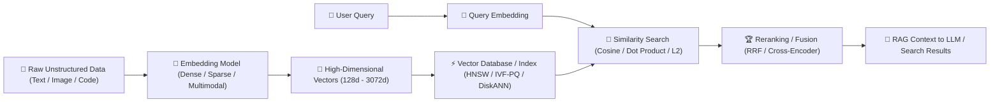

# 🚀 Awesome Vector Embedding Platform

  

  
  
  
  
  
  
  

---

## 📖 Overview & Ecosystem Guide

**Curated List of SaaS/Hosted Platforms & Open-Source Vector Embedding Technologies**  
*Comprehensive directory for Vector Embeddings, Embedding APIs, Vector Databases, Similarity Search Engines, Approximate Nearest Neighbor (ANN) Indexing, Semantic Retrieval & AI/RAG Infrastructure.*

This repository tracks the leading **SaaS/Hosted Platforms** and **Open-Source Projects** powering modern AI retrieval. These technologies generate, store, index, search, retrieve, and manage high-dimensional vector embeddings for:
- 🔍 **Semantic Search & Hybrid Retrieval** (Dense + Sparse / BM25)
- 🤖 **Retrieval-Augmented Generation (RAG)** & AI Agent Memory
- 🎯 **Recommendation Systems & Personalization**
- 🖼️ **Multimodal AI Search** (Text-to-Image, Audio, Video, Cross-Modal)
- ⚡ **High-Performance Approximate Nearest Neighbor (ANN)** Search

---

## 📑 Table of Contents

- [☁️ SaaS / Hosted Platforms](#️-saashosted-platforms)
- [⚡ Open-Source GitHub Projects](#-open-source-github-projects)
- [🏗️ Recommended Architecture Stacks](#️-recommended-architecture-stacks)
- [🧩 Embedding & Retrieval Building Blocks](#-embedding--retrieval-building-blocks)
- [📐 Core Vector Embedding Concepts](#-core-vector-embedding-concepts)
- [⭐ Star History](#-star-history)
- [🤝 How to Contribute](#-how-to-contribute)
- [📜 Disclaimer](#-disclaimer)

---

## ☁️ SaaS / Hosted Platforms

A curated comparison of fully-managed vector databases and hosted embedding APIs, sorted by **Company Valuation / Scale (Descending)**.

| Platform | Company Valuation / Scale | Description | Starting Pricing | Free Tier / Trial Limits |
| :--- | :--- | :--- | :--- | :--- |
| **[Cohere Embed](https://cohere.com/embed)** | **~$7.0B Valuation** ($970M+ raised) | Enterprise embedding API providing multilingual (100+ languages) and multimodal embedding models with 128k context window. | Starts at **$0.10 / 1M tokens** (Embed v3 Text), **$0.12 / 1M tokens** (Embed v4 Text), **$0.47 / 1M tokens** (Embed v4 Image). | **Free Trial Evaluation Key**: Unlimited evaluation duration, rate-limited to 100 requests/min (RPM) and 100,000 tokens/min across all endpoints for testing. |
| **[Astra DB Vector](https://www.datastax.com/products/datastax-astra)** | **~$1.6B Valuation** (Acquired by IBM / $220B+ market cap) | Serverless vector database built on Apache Cassandra by DataStax, combining vector search with operational NoSQL data. | **$0/mo** (Free); Pay-as-you-go starts at **$0.05 per 100K read ops**, **$0.15 per 100K write ops**, and **$0.25/GB-mo** storage. | **Free forever tier**: **$25 USD/month recurring usage credit** (~5M operations and 5 GB storage, up to 5 active databases). |
| **[Pinecone](https://www.pinecone.io/)** | **~$750M Valuation** ($138M raised, $100M+ ARR) | Fully managed cloud vector database designed for production AI applications, semantic search, RAG, and large-scale similarity search. | **$0/mo** (Starter); Builder plan: **$20/month** flat fee; Standard plan starts at **$50/month** minimum + usage ($0.33/GB-mo storage, $2/M write units, $8.25/M read units). | **Free forever Starter plan**: 1 project, 1 index, up to 100K–1M vectors, 1 GB storage, 500K chat input / 300K chat output / 500K context retrieval tokens/mo. (21-day Standard trial with $300 credits). |
| **[Zilliz Cloud](https://zilliz.com/)** | **~$400M–$500M Valuation** ($113M raised) | Managed cloud vector database built on Milvus for enterprise-scale vector search, AI retrieval, and multimodal applications. | **$0/mo** (Free); Serverless starts at **$0.05 / 1M vCUs** + $0.25/GB/mo storage; Dedicated clusters start at **$0.273/CU/hour** (~$196/month). | **Free forever plan**: 1 cluster, 5 GB storage, 2.5 million vCUs/month, up to 5 collections. (Free trial provides $100 credits valid for 30 days). |
| **[Qdrant Cloud](https://qdrant.tech/)** | **~$280M Valuation** ($88M raised) | Managed cloud version of Qdrant, providing vector search, metadata filtering, hybrid retrieval, and binary/scalar quantization. | **$0/mo** (Free); Standard paid clusters start at **~$25 to $65/month** (~$0.035/hr per node for 0.5 vCPU / 2 GB RAM, metered hourly by compute/RAM/disk). | **Free forever cluster**: 1 single-node cluster with 0.5 vCPU, 1 GB RAM, and 4 GB disk storage (~1M 768-dim vectors). Auto-suspends after 1 week inactivity. |
| **[Voyage AI](https://www.voyageai.com/)** | **~$220M Acquisition Valuation** (Acquired by MongoDB) | State-of-the-art embedding and reranking API models optimized for retrieval, RAG, code, finance, and legal domains. | Starts at **$0.02 / 1M tokens** (`voyage-4-lite`), **$0.06 / 1M tokens** (`voyage-4`), **$0.12 / 1M tokens** (`voyage-4-large`, `voyage-finance-2`, `voyage-code-3`). | **Free tier tokens**: **200 million free tokens** for general models (`voyage-4`, `voyage-4-lite`, `voyage-context-4`) and **50 million free tokens** for domain models upon signup, no credit card required. |
| **[Weaviate Cloud](https://weaviate.io/)** | **~$200M Valuation** ($67M raised) | Managed vector database and AI-native search platform supporting vector/hybrid search and integrated vectorization pipelines. | **$0/mo** (Free); Flex tier starts at **$45/month** minimum ($0.035/1M dimensions stored, $0.15/GiB objects); Plus tier starts at **$280/month**. | **Free forever cluster**: 1 cluster, 100,000 objects, 1 GB RAM, 10 GB disk, 1 collection, 2,000 embedding requests/day, and 1,000 query agent requests/month. |
| **[Jina AI](https://jina.ai/)** | **~$100M+ Est. Valuation** ($39M raised) | AI search foundation platform providing multilingual embedding, reranking, late-interaction (ColBERT), and multimodal APIs. | Starts at **$0.02 / 1M tokens** (standard embeddings) to **$0.05 / 1M tokens**; top-up packages start at **$10** (500M tokens). | **Free tier tokens**: **10 million free tokens** upon account/API key creation across all Search Foundation APIs; rate limit of 100 RPM / 100K TPM. |
| **[Chroma Cloud](https://www.trychroma.com/)** | **~$75M Valuation** ($18M raised) | Hosted vector database platform built around Chroma's developer-friendly vector storage and retrieval engine. | **$0/mo** base + usage ($2.50/GiB written, $0.33/GiB-mo storage, $0.0075/TiB queried); Team plan starts at **$250/month** (includes $100 usage credits). | **Free starter credit**: **$5 in free usage credits** on Starter tier ($0/mo subscription), supporting up to 10 databases and 10 team members. |
| **[Upstash Vector](https://upstash.com/docs/vector/overall/getstarted)** | **~$50M–$75M Est. Valuation** ($12M raised) | Serverless vector database designed for low-latency AI applications, RAG, and edge/serverless architectures. | **$0/mo** (Free); Pay-as-you-go starts at **$0.40 per 100,000 requests**; Fixed Pro plans start at **$60/month** (1M queries & 1M updates/day). | **Free forever plan**: **10,000 queries/day** and **10,000 updates/day**, 1 index, up to 100 MB storage. |

---

## ⚡ Open-Source GitHub Projects

Leading open-source vector databases, similarity search libraries, and embedding frameworks, **sorted by GitHub Star Count (Descending)**:

1. **[Milvus](https://github.com/milvus-io/milvus)**   
   Cloud-native, highly scalable open-source vector database built for massive-scale similarity search, multimodal AI, and billion-scale vector indexes.

2. **[FAISS](https://github.com/facebookresearch/faiss)**   
   Meta's gold-standard library for efficient similarity search, clustering of dense vectors, and GPU-accelerated ANN indexing.

3. **[Qdrant](https://github.com/qdrant/qdrant)**   
   High-performance vector similarity search engine and vector database written in Rust with rich payload filtering, scalar/binary quantization, and hybrid search.

4. **[Chroma](https://github.com/chroma-core/chroma)**   
   AI-native open-source embedding database designed for developer-friendly local prototyping, Python/JS SDKs, and distributed production RAG.

5. **[pgvector](https://github.com/pgvector/pgvector)**   
   Open-source vector similarity search extension for PostgreSQL supporting exact search, HNSW, IVFFlat, L2 distance, inner product, and cosine distance.

6. **[Jina](https://github.com/jina-ai/jina)**   
   Cloud-native multimodal AI search framework for building cross-modal search pipelines, document vectorization, and distributed neural search systems.

7. **[Sentence Transformers](https://github.com/UKPLab/sentence-transformers)**   
   State-of-the-art Python framework for compute-efficient sentence, text, and image embeddings based on BERT, RoBERTa, and modern Transformer backbones.

8. **[Weaviate](https://github.com/weaviate/weaviate)**   
   Open-source vector database for storing data objects and vector embeddings with hybrid lexical/vector search, multi-tenancy, and modular ML model integrations.

9. **[Annoy](https://github.com/spotify/annoy)**   
   Spotify's lightweight C++/Python library for Approximate Nearest Neighbors with memory-mapped static index files and low memory footprint.

10. **[OpenSearch](https://github.com/opensearch-project/OpenSearch)**   
    Community-driven, distributed search and analytics suite with built-in k-NN vector search engine powered by Lucene, FAISS, and NMSLIB algorithms.

11. **[txtai](https://github.com/neuml/txtai)**   
    All-in-one embeddings database for semantic search, LLM orchestration, knowledge graphs, and automated workflow pipelines.

12. **[FlagEmbedding (BGE)](https://github.com/FlagOpen/FlagEmbedding)**   
    BAAI General Embedding (BGE) suite offering top-performing dense embeddings, sparse multi-lingual models (BGE-M3), Visual BGE, and neural rerankers.

13. **[LanceDB](https://github.com/lancedb/lancedb)**   
    Developer-friendly, serverless embedded vector database built on the columnar Lance format, allowing zero-copy multi-modal querying and disk-backed indexing.

14. **[Vespa](https://github.com/vespa-engine/vespa)**   
    The open-source big data serving engine for real-time vector search, lexical search, machine-learned ranking, and large-scale tensor computation.

15. **[HNSWLib](https://github.com/nmslib/hnswlib)**   
    Fast, header-only C++ and Python library for Approximate Nearest Neighbor search based on Hierarchical Navigable Small World graphs.

16. **[Marqo](https://github.com/marqo-ai/marqo)**   
    End-to-end vector search engine with integrated multimodal embedding inference, document chunking, indexing, and storage.

17. **[Infinity](https://github.com/infiniflow/infinity)**   
    AI-native database delivering ultra-fast hybrid search on dense vectors, sparse vectors, multi-vector tensor representations (ColBERT), and full text.

18. **[USearch](https://github.com/unum-cloud/usearch)**   
    Compact, ultra-fast single-header vector search engine and standalone HNSW implementation with bindings for C++, Python, Rust, Java, and JavaScript.

19. **[pgvecto.rs](https://github.com/tensorchord/pgvecto.rs)**   
    Scalable vector database extension for Postgres written in Rust, supporting FP16, INT8 scalar quantization, and memory-efficient indexing (Vamana/HNSW).

20. **[Vald](https://github.com/vdaas/vald)**   
    Highly scalable distributed vector search engine built on Kubernetes and NGT (Neighborhood Graph and Tree) algorithm.

---

## 🏗️ Recommended Architecture Stacks

| Architecture Pattern | Recommended Technology Stack | Primary Use Case |
| :--- | :--- | :--- |
| **Simple Local RAG** | `Sentence Transformers` + `Chroma` + `LangChain / LlamaIndex` | Notebooks, prototypes, desktop apps, and small-scale retrieval systems. |
| **Production Enterprise RAG** | `BGE / E5` + `Qdrant` + `FastAPI` + `LlamaIndex` | Scalable microservice architecture for high-accuracy semantic search. |
| **PostgreSQL-Unified Stack** | `Sentence Transformers` + `pgvector / pgvecto.rs` + `PostgreSQL` | Applications where relational business metadata and vectors reside in the same DB. |
| **Billion-Scale Vector Search** | `BGE / Cohere` + `Milvus` + `Kafka` + `Kubernetes` | Distributed, multi-node enterprise vector indexing and high-throughput workloads. |
| **Hybrid Lexical & Semantic** | `BGE-M3` + `OpenSearch` + `BM25 + Vector Search` + `Reranker` | Systems requiring exact keyword filtering combined with deep semantic understanding. |
| **Multimodal Vision & Text** | `OpenCLIP / SigLIP / ColPali` + `LanceDB / Qdrant` + `Reranker` | E-commerce product search, document-image retrieval, and video/audio discovery. |
| **Embedded Zero-Server AI** | `Sentence Transformers` + `LanceDB` + `DuckDB` | Embedded analytics and local vector retrieval without hosting external servers. |
| **Advanced Neural Ranking** | `BGE / Jina` + `Vespa` + `ColBERT` + `Custom Rank Profiles` | High-complexity search ranking, tensor computations, and real-time re-ranking. |

---

## 🧩 Embedding & Retrieval Building Blocks

### 🧠 1. Embedding Models & Generation
- **Dense Text Models**: BGE (`bge-large-en-v1.5`), E5 (`e5-mistral-7b-instruct`), GTE, OpenAI (`text-embedding-3-large`), Cohere (`embed-v4`), Voyage (`voyage-4`), Jina (`jina-embeddings-v3`), Nomic (`nomic-embed-text`).
- **Sparse Models**: SPLADE, BM25, BGE-M3 Sparse Lexical Weights.
- **Late-Interaction / Multi-Vector**: ColBERT, ColPali, ColQwen.
- **Multimodal Models**: CLIP, OpenCLIP, SigLIP, ImageBind.

### 📐 2. Indexing Algorithms & ANN
- **Graph-Based**: HNSW (Hierarchical Navigable Small World), Vamana / DiskANN.
- **Tree & Inverted Files**: IVF (Inverted File Index), KD-Trees, Annoy Random Projection Trees.
- **Compression & Quantization**: Product Quantization (PQ), Scalar Quantization (SQ8/SQ4), Binary Quantization (BQ), Matryoshka Representation Learning (MRL).

### 🔍 3. Retrieval & Ranking Strategies
- **Hybrid Search**: Dense Vector Similarity + Sparse Lexical BM25 via Reciprocal Rank Fusion (RRF).
- **Neural Reranking**: Cross-Encoders (`bge-reranker-large`, `cohere-rerank-v3`, `jina-reranker-v2`).
- **Advanced RAG**: Contextual Compression, Query Expansion (HyDE), Agentic Graph RAG, Semantic Chunking.

---

## 📐 Core Vector Embedding Concepts

---

## ⭐ Star History

---

## 🤝 How to Contribute

Contributions are warmly welcomed! Please follow these guidelines:
1. **Fork the repository** and create your branch (`git checkout -b feature/awesome-entry`).
2. Add entries in the relevant category maintaining existing tabular and formatting conventions.
3. For **SaaS platforms**, provide starting pricing, free tier limits, and verifiable company valuation / scale.
4. For **Open-source repos**, include the star badge with `style=social&color=white` linked to `/stargazers`.
5. Submit a descriptive Pull Request explaining the addition.

---

## 📜 Disclaimer

This repository is a community-curated directory intended for educational and architectural evaluation. Product specifications, pricing tiers, token quotas, and valuation benchmarks are subject to change by their respective providers. Benchmark against your own workload before making production infrastructure decisions.
